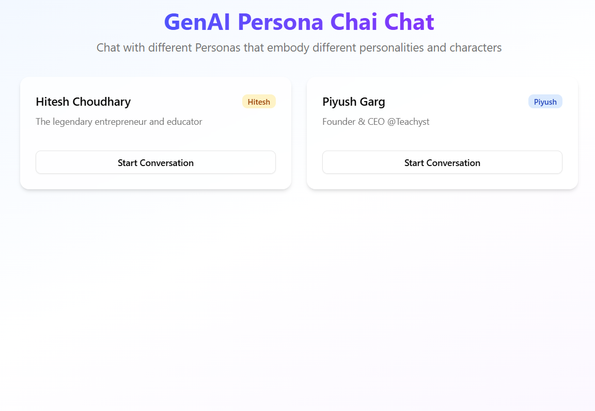

# GenAI Persona Chat 💬🤖

GenAI Persona Chat is a modern, beautiful chat interface built with **Next.js** + **TailwindCSS**, allowing you to roleplay with AI in any persona you choose.  
Powered by **Google Gemini API** (OpenAI-compatible endpoint), it makes AI responses feel alive and tailored to your chosen character.

🔗Link: https://genai-persona-chai.vercel.app/

<br>

## 📸 Demo Screenshot




<br>

## ✨ Features

- 🎭 **Custom Persona Roleplay** – Set a persona like "1920s detective", "Elon Musk", or "Shakespeare".
- 💎 **Beautiful UI** – Responsive, modern design with clean chat bubbles.
- ⚡ **Next.js 15 + Turbopack** – Fast, cutting-edge React framework.
- 🎨 **TailwindCSS** – Elegant styling and responsive layouts.
- 🧠 **Gemini API (OpenAI-compatible)** – Uses Google's powerful Gemini model.
- 📱 **Mobile-friendly** – Works great on phones, tablets, and desktops.
- 🛠 **No authentication required** – Start chatting right away.

<br>

## 🚀 Setup Guide

### 1️⃣ Clone the repository
```bash
git clone https://github.com/apoorv654123/GenAIPersonaChai.git
cd GenAIPersonaChai
````

### 2️⃣ Install dependencies

```bash
npm install
```

### 3️⃣ Configure environment variables

Create a `.env.local` file in the root directory:

```env
GEMINI_API_KEY=your_google_gemini_api_key
```

> 🔑 Get your API key from [Google AI Studio](https://aistudio.google.com/).

### 4️⃣ Run the development server

```bash
npm run dev
```

Open [http://localhost:3000](http://localhost:3000) in your browser.

<br>

## 📦 Build for production

```bash
npm run build
npm start
```

<br>

## 🛠 Tech Stack

* **Frontend:** [Next.js 15](https://nextjs.org/), [React 19](https://react.dev/)
* **Styling:** [TailwindCSS 4](https://tailwindcss.com/), [Lucide Icons](https://lucide.dev/)
* **UI Components:** [Shadcn UI](https://ui.shadcn.com/), Tailwind Merge
* **AI Backend:** [Google Gemini API](https://aistudio.google.com/) via OpenAI-compatible SDK
* **Package Manager:** npm


